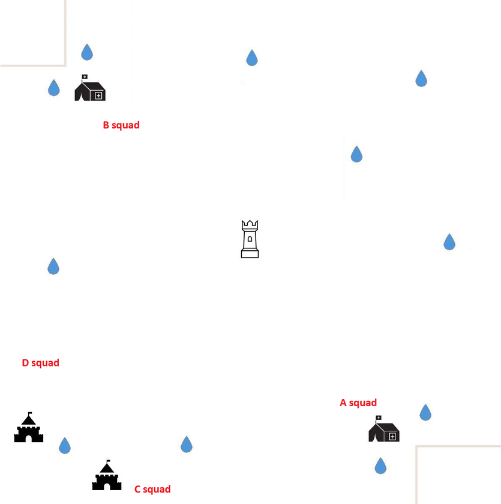
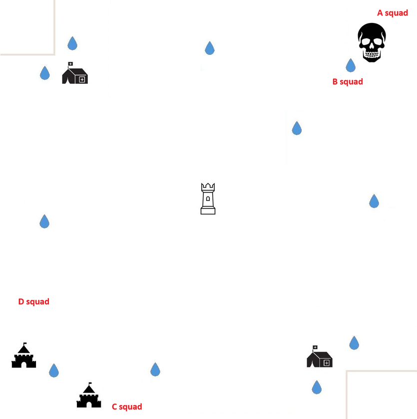
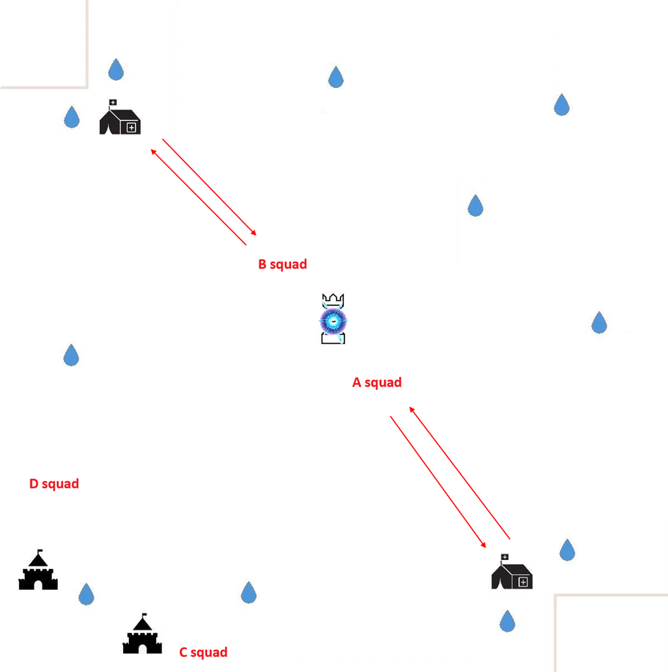
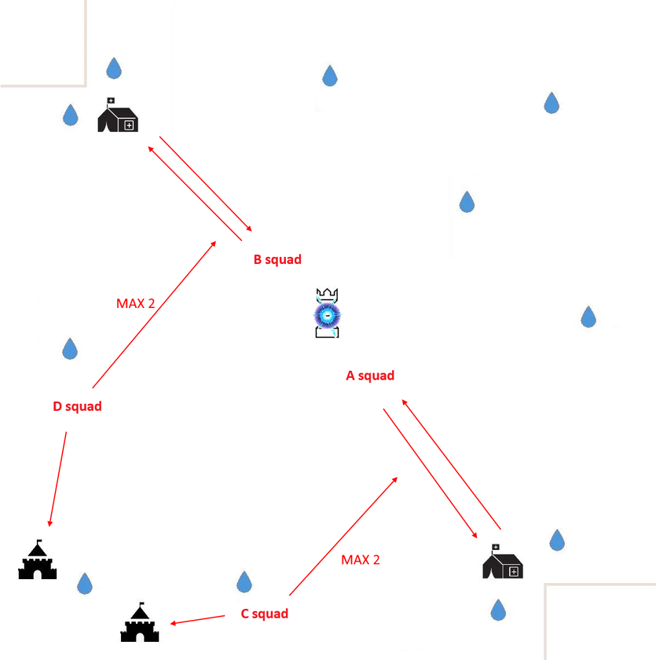

# Squad Overview

Your team is divided into four squads with distinct battlefield roles:

- A Squad - Strong Assault Unit
- B Squad - Strong Assault Unit
- C Squad - Defensive Support Unit
- D Squad - Defensive Support Unit

A & B are your power squads.

C & D are your control squads.

# A & B Squads - Stronger Half of the Team

## Primary Responsibilities

- A Squad: Capture and defend the area around enemy base.
- B Squad: Capture and control the area around the our base.

This creates dual-pressure lanes: one defensive, one offensive.

## Tyrant Protocol
When the Tyrant spawns, all 10 players from A + B immediately teleport to contest it. The first Tyrant is your scouting phase and coordination.

It reveals enemy strength:
- If the enemy is beatable → contest the second Tyrant.
- If not → ignore the second Tyrant and focus on stabilizing and holding buildings.

## Core Protocol
When the Core spawns:
- A Squad teleports to one side of the Crystal.
- B Squad teleports to the opposite side.

## Objectives
The full Core control through pincer positioning.

If the Core fight is still active when the next Tyrant appears than Core takes priority.

_Nobody leaves._

Losing Core is more damaging than losing a Tyrant.

# C & D Squads - Support and Defense

These squads consist of your weaker or mid-tier players, but their role is critical.

## Primary Responsibilities
Defend and monitor both Military Bases for the entire match. Maintain continuous control of these bases the buff is extremely valuable.

## Support Rules
If A or B needs help, 2 players from each of C & D may rotate to assist.

If the Core is active and Military Bases are stable, 2 players from each may support the Core fight.

If Military Bases come under attack → C & D stay and defend.

_No exceptions._

The Military Base buff often outweighs having extra bodies at the Crystal.

# General Rules for All Players

1. Know your squad. Follow your marker. _Do not freelance._
2. Reinforce the Core Carrier. Your core carrier will be targeted. Keep them alive.
3. Avoid having your highest damage players stuck on teleport cooldown. Prevent Teleport Lockout.
4. The enemy will try to force your teleport cooldown.
5. Reinforce If you see a teammate under attack immediately.
6. Refresh Building Captures. Keep your soldiers refreshed in buildings.

Try to keep F1 free for fast attack/defense. Never Teleport Alone
Share coordinates in chat. Wait for a squadmate.
Or teleport closer to your team. Solo ports = instant death.

## HQ Attacks
Do not attack HQs alone unless you are certain you overpower the target.

If it's evenly matched wait for backup.

## Healing Protocol
Heal in batches of 100 to maintain tempo and avoid long downtime.
